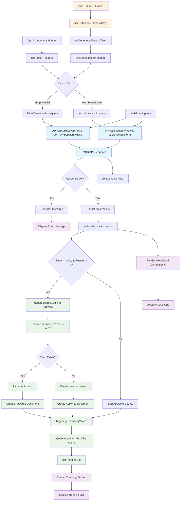

## About the Project

I started this mini project while learning the basics of React. I created a simple movie discovery application using React 19 as the frontend and Appwrite as the backend.

I also used Vite as the build tool for the frontend. For the movie data, I integrated the TMDB API, and for styling, I chose TailwindCSS with a custom theme using vanilla CSS.

<div className="flex justify-center">
  
</div>

he application uses Client Side Rendering to display movie data. I built reusable components like MovieCard for displaying individual movies, Search for the input functionality, and Spinner for loading states.

When the application loads for the first time, it triggers useEffect to fetch initial data from the /discover/movie?sort_by=popularity.desc endpoint and displays it through the MovieCard component.

For the search functionality, I implemented a debouncing system using the useDebounce hook from react-use library. When a user enters a keyword to search for a movie, the application doesn't immediately make a request to the API.

```js
// The magic happens here - balancing responsiveness with efficiency
useDebounce(() => setDebouncedSearchTerm(searchTerm), 500, [searchTerm]);
```

After 500 milliseconds, the application triggers `useEffect debounce Search Term` which will then synchronize data from the `/search/movie?query=${encodeURIComponent(query)}` endpoint.



Instead, the search system delays the request for 500 milliseconds. This prevents API spam and improves the user experience. After 500 milliseconds, the application triggers another useEffect for the debounced search term, which then fetches data from the `/search/movie?query=${encodeURIComponent(query)}` endpoint.

```js
export const updateSearchCount = async (searchTerm, movie) => {
    // 1. Use Appwrite SDK to update if the search term is exist in the database
    try {
        const result = await database.listDocuments(DATABASE_ID, COLLECTION_ID, [
            Query.equal('searchTerm', searchTerm)
        ]);

        // 2. If it does, update the count
        if (result.documents.length > 0) {
            const doc = result.documents[0];

            await database.updateDocument(DATABASE_ID, COLLECTION_ID, doc.$id, {
                count: doc.count + 1,
            })
        // 3. if it doesn't, create a new document with the search term and count as 1
        } else {
            await database.createDocument(DATABASE_ID, COLLECTION_ID, ID.unique(), {
                searchTerm,
                count: 1,
                movie_id: movie.id,
                poster_url: `https://image.tmdb.org/t/p/original/${movie.poster_path}`,
            });
        }
    } catch(err) {
        console.log(err);
    }
}
```

Throughout the development, I implemented proper error handling and loading states using useState hooks to manage different UI conditions. The application shows a spinner during API calls and displays error messages when requests fail, providing better user feedback.

I also implemented a simple trending algorithm that tracks movie popularity based on search frequency. When a user searches for a movie, the application uses Appwrite SDK to check if the search term already exists in the database through query operations.

If it doesn't exist, the application creates a new document with that search term. If it already exists, the application increases the count by 1. The trending section then displays the top 5 most searched movies using conditional rendering.

For production deployment, I configured the application with environment variables for API keys, set up Nginx web server configuration, and implemented SSL certificates to make it ready for real-world use.

---

**Check Out Website**: https://movie.fadjarrafi.xyz/

**Explore the Code**: https://github.com/fadjarrafi/movie-app

**Built With**: React, Vite, Tailwind CSS, Appwrite, and TMDB API

